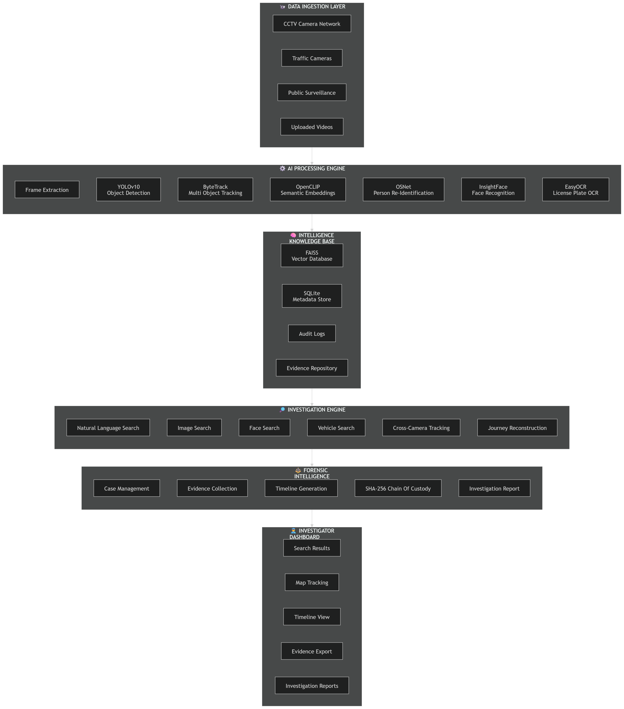

<div align="center">

# NiriXan AI

### AI Forensic Investigation Platform for Smart-City CCTV

*Describe a person in plain language. Find them. Track them across cameras.
Reconstruct the route they took. Hand over a sealed evidence report.*

<br>


**Hackathon:** ERH26_PS_07 · 4-week prototype

</div>

---

An investigator rarely starts with a face or a number plate. They start with a
description — *"a man in a white shirt carrying a backpack"* — and hundreds of hours
of footage. NiriXan AI turns that description into an investigation: it searches
footage semantically, follows one person from camera to camera, draws the real road
route between the sightings, and produces a court-ready report with a SHA-256 chain
of custody.

It is built to **generalise to unfamiliar footage** the system has never seen, and it
runs **entirely on a local machine** — a 6 GB laptop GPU is enough. No cloud
inference for detection, search or re-identification.

> **Try:** *"a white truck"* · *"a red hatchback near Diamond Market"* ·
> *"a person wearing a backpack"* · Hindi *"सफ़ेद ट्रक"*
> → ranked, timestamped detections with crops, filters, cross-camera tracking and a
> tamper-evident export.

---

## System architecture

<p align="center">
  
</p>

---

## Contents

- [Capabilities](#capabilities)
- [How an investigation flows](#how-an-investigation-flows)
- [Model stack](#model-stack)
- [Setup](#setup)
- [Running](#running)
- [Ingesting footage](#ingesting-footage)
- [API](#api)
- [Repository layout](#repository-layout)
- [Verification](#verification)
- [Known limitations](#known-limitations)
- [Responsible use](#responsible-use)

---

## Capabilities

| | Capability | What it means in practice |
|---|---|---|
| 🔎 | **Descriptive search** | Plain-language queries over ingested video via CLIP semantic retrieval — no tags, no manual metadata |
| 🌐 | **Multi-language** | Hindi and Gujarati queries auto-translated before search, with an offline phrase fallback |
| 🖼️ | **Image & person re-ID search** | Upload a crop; find visually similar detections or the same individual (OSNet) |
| 🎯 | **Track Person** | Follow one person through a clip from a multi-view reference, verified frame by frame |
| 🗺️ | **Journey reconstruction** | Same person across cameras, ordered in time, with the **real road route** between sightings |
| ⚖️ | **Tiered confidence** | Matches labelled *confirmed / probable / possible / weak*, and **ambiguous** when two candidates cannot be separated |
| 😐 | **Face gallery** | Best face anywhere in a person's track, scored on 9 quality factors; refuses to save an unusable image |
| 🚗 | **Plate recognition** | Plate-region detection → enhancement → multi-frame voting, searchable by full or partial plate |
| 📄 | **Evidence report (PDF)** | Original frame with the subject outlined, the matched close-up, an AI situational description, and every recorded particular |
| 🔐 | **Sealed export** | Zipped evidence package with a per-file SHA-256 manifest and a full audit log |
| 🕒 | **Real recording time** | Timestamps read from each clip's own metadata, not the moment it was ingested |
| 💾 | **Nothing is lost** | Evidence, cases, journeys and reports persist in SQLite across restarts |

---

## How an investigation flows

```
 1  Upload footage        →  detect · track · embed · index          (once, at ingest)
 2  Describe the subject  →  CLIP text embedding → FAISS → ranked results
 3  Open a result         →  footage jumps to the exact frame, subject boxed
 4  Track Person          →  follow them through that clip
 5  Journey Reconstruction→  same person in other cameras, tiered by confidence
 6  Map                   →  OSRM road route between the located sightings
 7  Save evidence         →  Evidence Gallery  →  per-exhibit PDF report
 8  Seal the case         →  ZIP + SHA-256 manifest + audit trail
```

Each step reads results computed **once at ingest** — search and tracking never
re-run the models over the video, which is why the interface stays responsive.

---

## Model stack

Six models, chosen for reliability on a small GPU rather than leaderboard scores.

| Stage | Model | Device |
|---|---|---|
| Object detection | YOLOv10 (+ optional India-vehicle detector) | GPU |
| Tracking | ByteTrack, CCTV-tuned | GPU |
| Semantic embeddings + zero-shot attributes | OpenCLIP ViT-B/16 (`laion2b_s34b_b88k`) | GPU |
| Person re-identification | OSNet (`osnet_x1_0`, torchreid) | GPU |
| Face detection & recognition | InsightFace `buffalo_l` | GPU |
| Licence-plate OCR | PaddleOCR (PP-OCRv4), Gemini Vision fallback for hard crops | CPU |
| Road routing | OSRM (local instance preferred, public demo fallback) | network |
| Report narration | Gemini Vision (optional; degrades to stored attributes) | network |

**Backend:** FastAPI · FAISS (cosine/IP) · SQLite · static `/media`
**Frontend:** React + Vite, dark command-centre theme, Leaflet maps
**Vector ↔ metadata join:** every FAISS row id *is* the SQLite `detection_id`, so a
search returns database rows directly with no second lookup table.

---

## Setup

Python 3.12, Node 18+ (tested on 24). An NVIDIA GPU is optional — it falls back to CPU.

```cmd
:: 1) Python env + PyTorch (CUDA 12.1 build; use the CPU index-url if no GPU)
python -m venv .venv
.venv\Scripts\python.exe -m pip install torch torchvision --index-url https://download.pytorch.org/whl/cu121
.venv\Scripts\python.exe -m pip install -r backend\requirements.txt

:: 2) Cache the model weights (one-time; enables offline runs)
.venv\Scripts\python.exe backend\scripts\warmup_models.py

:: 3) Frontend deps
cd frontend && npm install
```

<details>
<summary><b>Optional configuration</b></summary>

Create `backend/.env` for the optional network features:

```
GEMINI_API_KEY=...          # report narration + hard-plate fallback; omit to disable
ROUTE_OSRM_URL=...          # local OSRM instance (preferred, keeps routing offline)
ROUTE_OSRM_PUBLIC=0         # refuse the public OSRM demo entirely
```

Everything except road routing and report narration works with no keys and no
network. Both degrade gracefully and say so in the UI rather than failing.

</details>

---

## Running

```cmd
:: Backend  (from backend/)
..\.venv\Scripts\python.exe -m uvicorn app.main:app --port 8000
::  -> API docs http://localhost:8000/docs · health /api/health

:: Frontend (from frontend/)
npm run dev
::  -> http://localhost:5173
```

The Vite dev server proxies `/api`, `/media` and `/ws` to the backend on `:8000`.

---

## Ingesting footage

```cmd
:: Batch-ingest every clip in backend/data/videos
.venv\Scripts\python.exe backend\scripts\ingest_all.py --reset

:: Or upload through the UI / API - progress streams over /ws/ingest/{job_id}
POST /api/ingest/upload      (multipart: file, camera_id)
```

Recording start time is read from each clip automatically: a timestamp in the
filename, else the creation time inside the container, else the file's modification
time. Unknown cameras register themselves.

<details>
<summary><b>Re-processing after a pipeline change</b></summary>

```cmd
:: Re-run the full pipeline over named clips, keeping their camera + timeline
POST /api/ingest/reprocess   { "filenames": ["test1.mp4"], "plates": true, "faces": true }
```

Re-ingestion happens **before** the old rows are discarded, so an interrupted run
can never leave a clip with no analysis at all.

</details>

---

## API

| Method | Path | Purpose |
|---|---|---|
| `GET` | `/api/health` | device, GPU, camera count |
| `GET` | `/api/cameras` · `/api/videos` · `/api/library` | registry and footage |
| `POST` | `/api/search/text` | descriptive search (`language`, `filters`, `include_scenes`) |
| `POST` | `/api/search/image` | image / person re-ID search |
| `POST` | `/api/search/plate` | full or partial plate search |
| `GET` | `/api/track/{detection_id}/path` | per-frame trajectory within a clip |
| `POST` | `/api/journey/reconstruct` | cross-camera journey + road route |
| `GET` | `/api/journeys` · `/api/journeys/{id}/export` | stored journeys, JSON/GeoJSON export |
| `GET` | `/api/camera-registry` · `/api/camera-registry/status` | siting, GPS, routing readiness |
| `POST` | `/api/faces/save` · `GET /api/faces/saved` | face gallery |
| `GET` | `/api/case` · `PUT /api/case/evidence` | persistent case + evidence set |
| `POST` | `/api/case/report` | PDF evidence report |
| `POST` | `/api/export` · `GET /api/exports` | sealed forensic export |
| `POST` | `/api/ingest/upload` + `WS /ws/ingest/{job_id}` | ingest with live progress |
| `GET` | `/api/audit` · `/api/history` | audit trail, investigation activity |
| `GET` | `/api/system/info` | models, thresholds, storage, index sizes |

Full interactive reference at `/docs`.

---

## Repository layout

```
backend/app/
  main.py                FastAPI app, routers, /media static, /ws progress
  config.py              paths, model names, thresholds, vocabularies
  database.py            SQLite schema + helpers
  routes*.py             REST routers (search, library, journey, faces, case, registry…)

  ingestion/             video → evidence
    pipeline.py            orchestrates one clip end to end
    tracker.py             ByteTrack + appearance-verified association
    identity_guard.py      refuses an association that changes a track's identity
    embedder.py            CLIP embeddings + zero-shot attributes
    reid_embedder.py       OSNet person embeddings
    face_recognizer.py     InsightFace
    anpr.py / plate_reader.py  plate detection → enhance → multi-frame voting
    recording_meta.py      real recording time from filename / container / mtime

  search/                vector_store, text_search, image_search, describe_search,
                         track_path, cross_camera

  track_identity.py      multi-view identity descriptor per track
  track_match.py         track-to-track candidate matching, tiered
  identity_fusion.py     fuses appearance + context signals into one score
  journey.py             journey assembly, nodes, alternatives
  journey_engine.py      distance, travel time, direction, plausibility
  routing.py             OSRM / GraphHopper / Valhalla + persistent route cache
  camera_registry.py     camera siting, coordinate parsing, coverage cones
  faces_gallery.py       best-face selection + face gallery
  case_store.py          persistent evidence set + case metadata
  case_report.py         PDF evidence report
  gemini_report.py       Gemini situational descriptions (optional)
  forensics.py           SHA-256 sealed export

backend/scripts/         ingest, benchmarks and verification suites
backend/data/            cctv.db, faiss_indexes/, crops/, frames/, videos/, exports/

frontend/src/
  pages/                 Dashboard, Workspace, Evidence, FaceGallery, Journey,
                         CameraRegistry, CaseFile, Settings
  components/            VideoPlayer, TrackingViewer, CameraMap, JourneyMap, VehicleInfo
  context/investigation.jsx   shared case state, persisted to the backend
  api.js                 typed API client
```

---

## Verification

Every capability has an automated check or benchmark under `backend/scripts/`:

```cmd
:: from backend/  (UTF-8 so Hindi/Gujarati print correctly on Windows)
set PYTHONUTF8=1
..\.venv\Scripts\python.exe -u scripts\run_all_checks.py
```

| Suite | Covers |
|---|---|
| `reingest_and_verify.py` | ingest integrity, DB ↔ FAISS consistency |
| `verify_plates.py` · `benchmark_anpr.py` | plate OCR and the ANPR pipeline |
| `verify_translate.py` | Hindi / Gujarati query translation |
| `verify_forensics.py` | export manifest + SHA-256 seal |
| `verify_robustness.py` | unfamiliar footage the system never trained on |
| `verify_api.py` | REST + WebSocket contract |
| `benchmark_tracking.py` · `benchmark_track_person.py` | track fragmentation, target identity |
| `benchmark_identity_fusion.py` | cross-camera identity accuracy and false-match rate |
| `benchmark_gis_routing.py` | road routing vs straight-line distance |

---

## Known limitations

Stated plainly, because a forensic tool that hides its weaknesses is worse than one
that admits them.

- **Attribute accuracy.** CLIP zero-shot colour and type degrade on small or distant
  crops. Reliable on large, clear crops; treated as one signal among several rather
  than as fact.
- **Re-ID weights.** OSNet uses generic ImageNet weights. Market-1501 weights would
  sharpen person re-identification and are a drop-in swap.
- **Cross-camera evidence needs camera coordinates.** A route can only be drawn
  between cameras whose positions are recorded in the Camera Registry; cameras
  without them are named in the response rather than silently skipped.
- **Plate OCR is CPU-bound.** The bundled PaddlePaddle build has no CUDA support, so
  plate reading is the slowest stage. `paddlepaddle-gpu` would speed it up
  substantially.
- **Scale.** FAISS uses an exact `IndexFlatIP` linear scan — right for prototype
  volumes. City scale would swap in an ANN index (IVF/HNSW), a standard change.
- **Report narration needs a key and quota.** Without either, reports still build
  from stored attributes and state in the document why the narration is missing.
- **Translation.** The online path uses `deep-translator`; a small offline phrase
  dictionary covers common descriptive terms when there is no internet.

---

## Responsible use

This system is intended for **authorised investigative use only**.

- Face recognition is gated behind `config.FACE_RECOGNITION_ENABLED`.
- Every search and export is written to an audit log.
- Exports carry a SHA-256 chain-of-custody seal; altering any file breaks it.
- AI-written descriptions in reports are labelled machine-generated and requiring
  officer verification. The prompts forbid identifying individuals, asserting that
  an offence occurred, or attributing intent.
- Confidence is always shown. Where the evidence cannot separate two candidates the
  system reports **ambiguous** rather than choosing one.
